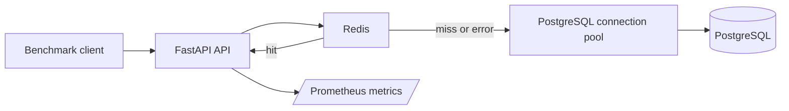

# Distributed Systems Performance Lab

A FastAPI performance and resilience lab that measures how PostgreSQL connection pooling, Redis caching, dependency failure, and concurrency change backend behavior.

[](https://github.com/gabbyb-cloud/distributed-systems-performance-lab/actions/workflows/ci.yml)


## Why it exists

Backend performance problems are often blamed on the wrong component. I built this lab to compare concrete changes—database connection reuse, caching, concurrency, and dependency failure—and see which ones actually matter for a small API workload.

The goal is to connect performance testing with reliability engineering: measure the bottleneck, observe failure behavior, and avoid treating local benchmark numbers as production capacity.

## Architecture



Redis is treated as an optimization rather than the source of truth. If a Redis read fails, requests can fall back to PostgreSQL as long as the database remains available.

## Key design decisions

- **Measure before optimizing.** The project compares baseline database access, pooled PostgreSQL, Redis cache hits, and Redis failure instead of assuming a cache is automatically the best improvement.
- **Reuse database connections.** PostgreSQL access uses a connection pool so requests do not repeatedly pay connection setup cost.
- **Treat Redis as optional.** Cache misses and Redis read errors route to PostgreSQL rather than turning a cache outage into an application outage.
- **Bound dependency behavior.** Redis connection and socket timeouts are set to 0.1 seconds with retries disabled so a slow cache does not stall requests indefinitely.
- **Track tail latency, not just averages.** Benchmarks record throughput, average latency, p95, and p99 because slow requests are hidden by averages alone.
- **Test concurrency as a variable.** The lab compares multiple concurrency levels rather than assuming more parallelism always improves throughput.

## Quick start

Requirements: Python 3.14, Docker with Docker Compose, and a shell such as Ubuntu or WSL.

```bash
git clone https://github.com/gabbyb-cloud/distributed-systems-performance-lab.git
cd distributed-systems-performance-lab
cp .env.example .env
docker compose up -d
python3.14 -m venv .venv
source .venv/bin/activate
python -m pip install -r requirements.txt
uvicorn app.main:app
```

The API runs at `http://127.0.0.1:8000`.

Useful endpoints:

- `/` — application introduction
- `/items/1` — item lookup used by the benchmarks
- `/metrics` — Prometheus-format application metrics

Stop the supporting services with:

```bash
docker compose down
```

## Testing

Run the test suite with:

```bash
python -m pytest -v
```

The current suite contains eight tests covering:

- root endpoint behavior
- cached item responses
- PostgreSQL fallback routing
- missing item responses
- cache reads and misses
- Redis read errors
- Redis write errors

The tests use controlled substitutes for Redis and database operations. That makes failure paths deterministic, but it also means they do not prove real PostgreSQL or Redis availability end to end.

GitHub Actions runs the test suite on pushes and pull requests using Python 3.14.

## Reliability and tradeoffs

**Redis failure:** cache read errors fall back to PostgreSQL instead of failing the request solely because Redis is unavailable. This improves resilience to a cache outage, but PostgreSQL is still a required dependency.

**Connection pooling:** pooling reduced connection overhead substantially for this workload. The tradeoff is that pool sizing becomes part of system behavior and can become a bottleneck if configured poorly.

**Caching:** Redis produced only a small additional improvement over pooled PostgreSQL for the tested primary-key lookup. That does not mean caching is generally ineffective; it means this workload was too small and simple to justify a larger claim.

**Concurrency:** higher concurrency did not continuously increase throughput. Beyond the best tested level, tail latency increased and throughput declined, showing that extra parallelism can create contention instead of useful capacity.

**Timeouts:** short Redis timeouts keep the fallback path responsive, but aggressive timeout values can also cause healthy-but-slow operations to be abandoned too quickly in a different environment.

**Observability:** the service exposes Prometheus-format metrics, but this repository does not include a full monitoring stack. Collection, dashboards, and alerting would need separate infrastructure.

**Benchmark scope:** all measurements are local, short-duration experiments. They are useful for comparing configurations in this lab, not for predicting production capacity.

## Results

The recorded experiments used 200 measured requests per run at concurrency 10. Baseline, pooled PostgreSQL, and Redis cache-hit tests used five runs each; the Redis-unavailable test used six. All recorded runs reported zero measured request errors.

| Experiment | Throughput | Average latency | p95 | p99 |
| --- | ---: | ---: | ---: | ---: |
| PostgreSQL baseline | 223.45 req/s | 44.67 ms | 77.22 ms | 113.41 ms |
| PostgreSQL with pooling | 640.24 req/s | 15.36 ms | 28.59 ms | 38.73 ms |
| Redis cache hits | 652.08 req/s | 15.38 ms | 33.27 ms | 48.29 ms |
| Redis unavailable | 395.10 req/s | 24.87 ms | 40.82 ms | 50.54 ms |

The largest improvement in these local experiments came from PostgreSQL connection pooling: throughput increased from **223.45 req/s to 640.24 req/s** while average and tail latency dropped substantially.

Redis cache hits reached **652.08 req/s**, only a small improvement over pooled PostgreSQL for this workload. When Redis was unavailable, throughput fell to **395.10 req/s**, but requests continued through PostgreSQL fallback.

A separate concurrency experiment tested levels 1, 10, 25, and 50. Throughput peaked at concurrency 10 among the tested values; higher concurrency increased tail latency and reduced throughput.

These measurements are workload-specific and hardware-dependent. The current code always uses pooling and checks Redis first, so reproducing the historical baseline configurations requires the corresponding recorded experiment setup in [`experiments/`](experiments/).

## Run the benchmarks

Keep the API running, then in a second terminal:

```bash
source .venv/bin/activate
python benchmarks/baseline.py
python benchmarks/concurrency.py
```

The baseline script measures 200 requests at concurrency 10 against the currently running configuration.

The concurrency script runs five trials at each concurrency level: 1, 10, 25, and 50. Each trial measures 200 requests, with 10 warm-up requests before measurement.

Measurement notes:

- latency starts after a request acquires a client concurrency slot
- latency statistics include successful and failed measured requests
- throughput counts all attempted measured requests
- concurrency summaries average trial-level percentiles rather than combining every request into one percentile calculation
- error counts should be interpreted alongside latency and throughput

## What I'd do next

- Add integration tests that use real PostgreSQL and Redis containers so fallback behavior is verified beyond mocked dependencies.
- Add a Prometheus/Grafana stack and separate metrics for cache misses versus Redis failures, making dependency behavior easier to distinguish operationally.
- Run longer, concurrent load tests with multiple query shapes and dataset sizes before drawing broader conclusions about capacity or caching value.
